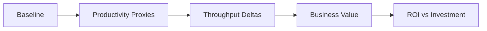

# Phase 2: Impact & ROI

**Is Copilot improving delivery outcomes? Can you defend the investment?**

Phase 2 bridges the gap between adoption data and business impact. Usage metrics tell you Copilot is being *used* — they don't tell you what that usage is *doing* to your software delivery.

---

## The Observability Gap

You know your acceptance rate is 35%. But has that changed how fast you ship? Are PRs moving faster? Is deployment cadence improving?

**The missing link: correlating AI adoption with delivery outcomes.**

Without this correlation, you're defending a license investment with activity metrics alone — and that story gets thin fast in a QBR.

---

## Where to Start

| Your situation | Start here |
|---|---|
| Need to understand what delivery metrics to track | [Metrics Guide](metrics.md) — DORA, PR lifecycle, what to correlate |
| Want a prebuilt path for DORA + Copilot correlation | [Using Apache DevLake](apache-devlake.md) — one implementation path, 1-3 days |
| Need to build an ROI case for leadership | [ROI Framework](roi-framework.md) — 5-step formula, exec narrative |
| Looking for tools to measure impact | [Tools & Resources](tools.md) — Phase 2 tool catalog |

---

## Key Impact Metrics at a Glance

| Metric | What It Tells You | Source |
|---|---|---|
| **PR Cycle Time** | Delivery speed (open → merge) | GitHub / analytics platform |
| **Deployment Frequency** | Throughput cadence | CI/CD / analytics platform |
| **Change Failure Rate** | Quality under velocity | Incident tracking / analytics platform |
| **MTTR** | Recovery speed | Incident tracking |
| **Time to Merge** | Review efficiency | GitHub PR data |
| **ROI Ratio** | Investment justification | Calculated |

→ Full definitions: [Metrics Guide](metrics.md)

---

## The ROI Approach

→ Step-by-step: [ROI Framework](roi-framework.md)

---

!!! warning "Correlation ≠ Causation"
    Even with strong correlation data, you're showing association, not proving causation. Triangulate with developer surveys, controlled rollouts, and time-series analysis.

---

**What to do next:**

- :material-book-open: [Metrics Guide](metrics.md) to understand what to measure
- :material-connection: [Using Apache DevLake](apache-devlake.md) if you want a prebuilt correlation stack
- :material-calculator: [ROI Framework](roi-framework.md) to build your executive case
