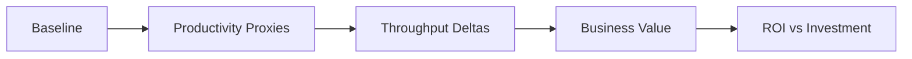

# Phase 2: Impact & ROI

Chapter 2

**Is your AI coding agent improving delivery outcomes? Can you defend the investment?**

Phase 2 bridges the gap between adoption data and business impact. Usage metrics tell you the AI tool is being *used* — they do not tell you where developer friction is falling, whether delivery is improving, or how those changes connect to business value.

---

## The Observability Gap

You know your acceptance rate is 35%. But has that changed how fast you ship? Are PRs moving faster? Is deployment cadence improving? Are developers reporting less friction and more confidence in their daily workflow?

**The missing link: combining Developer Experience signals, delivery outcomes, and business value.**

Good Developer Experience measurement looks for points of friction, tracks whether they shrink, and then shows whether those improvements compound into better delivery, stronger developer sentiment, and clearer ROI. Without that chain, you're defending a license investment with activity metrics alone — and that story gets thin fast in a QBR.

---

## In this chapter

-   :material-book-open:{ .lg .middle } **[Metrics Guide](metrics.md)**

    ---

    Define the outcome, delivery, and sentiment signals that make up a credible impact story.

-   :material-calculator:{ .lg .middle } **[ROI Framework](roi-framework.md)**

    ---

    Turn improvements into a defensible ROI narrative for leadership, finance, and procurement.

-   :material-source-branch:{ .lg .middle } **[Using Apache DevLake](apache-devlake.md)**

    ---

    Follow a concrete path for correlating AI coding agent usage with engineering delivery metrics.

-   :material-tools:{ .lg .middle } **[Tools & Resources](tools.md)**

    ---

    Compare the platforms and supporting tools that can power your Phase 2 reporting stack.

---

## Choose your starting point

| Your situation | Start here |
|---|---|
| Need to understand what to measure across Developer Experience, delivery, and value | [Metrics Guide](metrics.md) — friction signals, surveys, DORA, and value framing |
| Need to build an ROI case for leadership | [ROI Framework](roi-framework.md) — 5-step formula, evidence stack, exec narrative |
| Want a prebuilt path for DORA + AI coding tool correlation | [Using Apache DevLake](apache-devlake.md) — one implementation path, 1-3 days |
| Looking for tools to measure impact | [Tools & Resources](tools.md) — Phase 2 tool catalog |

---

## Key Impact Metrics at a Glance

| Metric | What It Tells You | Source |
|---|---|---|
| **PR Cycle Time** | Delivery speed (open → merge) | GitHub / analytics platform |
| **Deployment Frequency** | Throughput cadence | CI/CD / analytics platform |
| **Change Failure Rate** | Quality under velocity | Incident tracking / analytics platform |
| **MTTR** | Recovery speed | Incident tracking |
| **Time to Merge** | Review efficiency | GitHub PR data |
| **Developer Satisfaction** | Friction reduction and workflow confidence | Developer surveys |
| **ROI Ratio** | Investment justification | Calculated |

→ Full definitions: [Metrics Guide](metrics.md)

!!! info "Do not skip developer surveys"
    Delivery telemetry shows **what** changed. Developer surveys show **where friction still exists** and whether the AI coding agent is improving confidence, flow, and perceived value.

    Example Microsoft Forms survey starters (may require Microsoft 365 access):

    - [Developer survey 1](https://forms.office.com/Pages/ShareFormPage.aspx?id=v4j5cvGGr0GRqy180BHbR34hWRZZ-8pFpBporu7qxHBUNFpSOFZORjNFNEg2OTRFSUlQRTlPNEc4Sy4u&sharetoken=rWoZYGvI2EhPesse1YCv)
    - [Developer survey 2](https://forms.office.com/Pages/ShareFormPage.aspx?id=v4j5cvGGr0GRqy180BHbR34hWRZZ-8pFpBporu7qxHBUOUtRTDBRVlRPS1RCTlM1OFIxWjgyRjE5Uy4u&sharetoken=0Q5OivxWN0pb9Oq9lkDx)
    - [Developer survey 3](https://forms.office.com/Pages/ShareFormPage.aspx?id=v4j5cvGGr0GRqy180BHbR34hWRZZ-8pFpBporu7qxHBUOFBGOVFTMkw0WFBJTUtFQzA5OE85Vk1JVy4u&sharetoken=ukwlljw1HXjO92V9Lmo9)
    - [Developer survey 4](https://forms.office.com/Pages/ShareFormPage.aspx?id=v4j5cvGGr0GRqy180BHbR34hWRZZ-8pFpBporu7qxHBUN1FLNEVTRTJPN0I1U1JVUFkyNjVHWjcyRi4u&sharetoken=u03lk7G9SQoaPlxf6Ckx)

---

## The ROI Approach

→ Step-by-step: [ROI Framework](roi-framework.md)

---

!!! warning "Correlation ≠ Causation"
    Even with strong correlation data, you're showing association, not proving causation. Triangulate with developer surveys, controlled rollouts, and time-series analysis.

---

**What to do next:**

- :material-book-open: [Metrics Guide](metrics.md) to understand what to measure
- :material-calculator: [ROI Framework](roi-framework.md) to build your executive case
- :material-connection: [Using Apache DevLake](apache-devlake.md) if you want a prebuilt correlation stack
- :material-file-document: [Templates](../exec-templates/index.md) when you're ready to package the story
