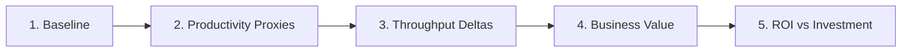

# ROI Framework

A 5-step process to build a defensible ROI case for AI-assisted development.

Start by identifying where developer workflows are still slow, repetitive, or frustrating. Then show whether reducing that friction improves delivery, developer satisfaction, and ultimately business value.

---

## Step 1: Establish Baseline

Capture pre-rollout or low-adoption metrics. Use **4-8 weeks** minimum, and include at least one short developer survey so you have a baseline for perceived friction and satisfaction.

| Metric | Source |
|---|---|
| PR cycle time (median) | GitHub / DevOps platform |
| Deployment frequency | CI/CD pipeline |
| Code review turnaround | PR review data |
| Developer satisfaction | Pulse surveys |

---

## Step 2: Quantify Productivity Proxies

Track your AI coding agent's leading indicators over your measurement window:

- **Acceptance rate trends** — growth suggests deepening adoption
- **Lines added with AI** — directional volume indicator
- **Chat engagement depth** — complex tasks vs simple completions
- **Self-reported time savings** — developer surveys

!!! warning "Proxy ≠ Proof"
    These are necessary but not sufficient. Pair with delivery outcomes in Step 3.

---

## Step 3: Quantify Throughput Deltas

Compare baseline to current state:

| Metric | Baseline | Current | Delta |
|---|---|---|---|
| PR cycle time | 4.2 days | 2.8 days | **-33%** |
| PR merge count / dev / week | 2.1 | 3.0 | **+43%** |
| Deployment frequency | 3/week | 5/week | **+67%** |
| Code review turnaround | 18 hours | 12 hours | **-33%** |

!!! tip "Segment by adoption tier"
    Using [Apache DevLake](apache-devlake.md) or your existing analytics stack, compare low/medium/high adoption teams. A gradient across tiers is stronger evidence than before/after alone.

---

## Step 4: Translate to Business Value

| Category | Formula | Example |
|---|---|---|
| **Cost avoidance** | Hours saved × blended rate | 50 devs × 4 hrs/wk × 48 wks × $85/hr = **$816K/yr** |
| **Opportunity acceleration** | Features shipped earlier × revenue/feature | 12 features × 3 wks earlier × $50K/mo = **$1.8M** |
| **Quality improvement** | Fewer incidents × cost/incident | 15% fewer × 200/yr × $5K = **$150K/yr** |
| **Developer satisfaction** | Retention improvement × replacement cost | 5% retention lift × 300 devs × $50K = **$750K/yr** |

!!! note
    Pick your strongest 2-3 categories. Cost avoidance is easiest to defend; opportunity acceleration is most compelling to executives.

---

## Step 5: ROI vs Investment

$$
\text{ROI} = \frac{\text{Total Value} - \text{License Cost}}{\text{License Cost}} \times 100\%
$$

**Example:**

| Component | Value |
|---|---|
| License cost (250 seats × $19/mo × 12) | $57,000 |
| Cost avoidance | $408,000 |
| Quality improvement | $75,000 |
| **Total value** | **$483,000** |
| **ROI** | **747%** |

!!! tip "Present as a range"
    - **Conservative** (high-confidence only): 300-400%
    - **Moderate** (reasonable estimates): 600-800%
    - **Optimistic** (includes acceleration): 1,000%+

---

## Pitfalls to Avoid

| :material-close-circle: Don't | :material-check-circle: Do Instead |
|---|---|
| Use acceptance rate alone as ROI | Pair with delivery outcome deltas |
| Ignore confounding variables | Acknowledge team/process changes |
| Extrapolate from small samples | Use 4-8 weeks, multiple teams |
| Conflate individual speed with team throughput | Measure team-level outcomes |
| Promise exact dollar figures | Use ranges with confidence levels |

---

## Strengthening Your Case

| Evidence Type | Confidence |
|---|---|
| Metrics + delivery correlation | :material-star::material-star::material-star: Medium |
| Developer surveys | :material-star::material-star: Medium |
| Adoption-tier segmentation | :material-star::material-star::material-star::material-star: High |
| Controlled A/B rollout | :material-star::material-star::material-star::material-star::material-star: Very High |

---

**What to do next:**

- :material-file-chart: Build your summary with the [ROI One-Pager Template](../exec-templates/roi-one-pager.md)
- :material-presentation: Structure your review with the [QBR Outline](../exec-templates/qbr-outline.md)
- :material-connection: Need a prebuilt implementation path? [Use Apache DevLake](apache-devlake.md)
