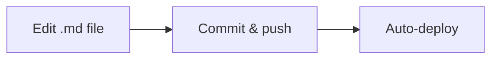

# Implementation Plan

**How this toolkit was built and how to maintain it.**

---

## :material-stairs: Build Phases

The toolkit was developed in three phases, each building on the previous:

=== "Phase 1: Scaffold & Core Content"

    **Objective:** Establish repository structure and author all core documentation pages.

    - [x] Initialize repo with MkDocs Material configuration
    - [x] Define site navigation and page hierarchy
    - [x] Author core pages: metrics overview, dashboards, tools, playbooks, ROI
    - [x] Create FAQ, glossary, and references
    - [x] Add Mermaid diagrams for architecture and workflows

=== "Phase 2: Enrich & Validate"

    **Objective:** Refine content, add supporting assets, and incorporate feedback.

    - [x] Add sample data and worked examples
    - [x] Embed diagrams for API flow, adoption journey, and tool landscape
    - [x] Review with stakeholders (field teams, engineering, leadership)
    - [x] Incorporate feedback and address gaps
    - [x] Validate all external links and API references

=== "Phase 3: Publish & Announce"

    **Objective:** Make the toolkit available and drive awareness.

    - [ ] Deploy to GitHub Pages via CI/CD
    - [ ] Share with field teams and GBB organization
    - [ ] Announce internally via Teams channels and email
    - [ ] Collect initial feedback and iterate

---

## :material-wrench: Maintenance Guide

### Content updates

Submit PRs to `/docs/`. Each page is standalone markdown — no build step required for content authoring. Preview locally with:

```bash
mkdocs serve
```

### Tool catalog

When new community or official tools emerge, add entries following the existing template format on the [Tool Catalog](tool-catalog.md) page. Include: name, description, link, and category.

### API changes

Monitor the [GitHub Changelog](https://github.blog/changelog/) for metrics API changes. Update the [Dashboards & Data Sources](dashboards-data-sources.md) page when endpoints change or new features are added.

### Legacy API retirement

!!! warning "Action item: Post-April 2026"
    After the **April 2, 2026** sunset of the legacy Copilot Metrics API, remove all legacy API references from the documentation and update migration guidance to reflect the completed transition.

### Quarterly review

Review the following for accuracy each quarter:

| Item | What to check |
|---|---|
| KPIs & metrics | Are definitions still aligned with API output? |
| ROI templates | Do formulas reflect current pricing and features? |
| Playbooks | Are adoption strategies still relevant? |
| Tool catalog | Are listed tools still maintained and accurate? |
| External links | Are all URLs still valid? |

Tag releases after each quarterly review: `v1.0`, `v1.1`, etc.

### Diagrams

Keep Mermaid diagrams **in-page** for easy editing. No external diagram tools are required — all diagrams render natively in MkDocs Material.

```markdown
<!-- Example: editing a diagram is as simple as editing markdown -->

```

---

## :material-shield-check: Governance

| Aspect | Detail |
|---|---|
| **Owner** | DevExp GBB team |
| **Review cadence** | Quarterly |
| **Versioning** | Git tags (`v1.0`, `v1.1`, etc.) |
| **Feedback** | [GitHub Issues](https://github.com) on the repo |

---

## :material-arrow-right-bold: What to Do Next

- **Deploy the site** — Set up GitHub Pages with a `mkdocs gh-deploy` workflow or GitHub Actions CI/CD
- **Share with your team** — Distribute the site URL to field sellers, solution architects, and engineering leads
- **Collect feedback** — Open GitHub Issues for suggestions, corrections, and new content requests
- **Schedule the first quarterly review** — Put a recurring calendar event to review and update content
- **Contribute** — Add new tools, update playbooks, and refine ROI models as the Copilot platform evolves
