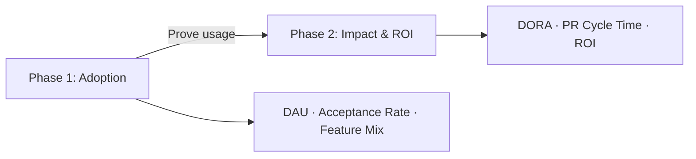

---
hide:
  - toc
---

# GitHub Copilot Metrics & ROI Toolkit

**Measure adoption. Prove impact. Defend ROI.**

A measurement guide — not an adoption guide — for teams that have rolled out Copilot and need to quantify results.

---

## Start Here

| Your role | Start with |
|---|---|
| **Engineering Leader** (CTO, VP Eng) | [ROI Framework](impact/roi-framework.md) · [QBR Template](exec-templates/qbr-outline.md) |
| **DevEx / Platform Team** | [Phase 1: Adoption](adoption/index.md) · [Phase 2: Impact](impact/index.md) |
| **FinOps / Procurement** | [ROI One-Pager](exec-templates/roi-one-pager.md) · [Premium Request Costs](impact/tools.md) |
| **Copilot Admin** | [Adoption Metrics](adoption/metrics.md) · [Dashboards & APIs](dashboards-data-sources.md) |

---

## The Two Phases

-   :material-rocket-launch:{ .lg .middle } **[Phase 1: Adoption](adoption/index.md)**

    ---

    Who's using Copilot, where, and how deeply?

-   :material-chart-scatter-plot:{ .lg .middle } **[Phase 2: Impact & ROI](impact/index.md)**

    ---

    Is it improving delivery? Can you defend the investment?

---

**Quick links:** [Measurement Journey](measurement-journey.md) · [Tool Catalog](tool-catalog.md) · [Templates](exec-templates/index.md) · [FAQ](faq-glossary.md)
