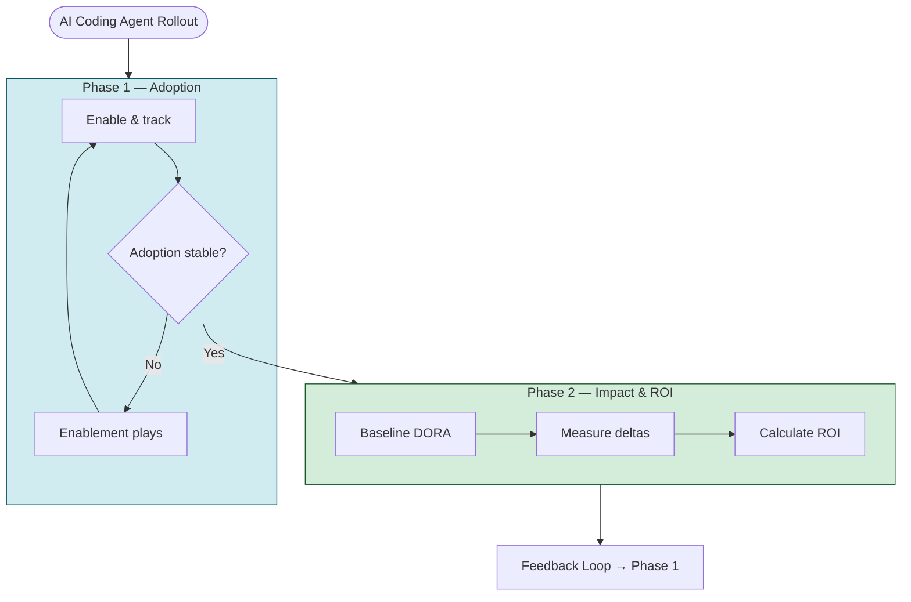

# Measurement Journey

Start here

## From adoption to impact: a two-phase model

Measuring AI coding agent impact works best as a progression. This toolkit uses an opinionated two-phase model so you can baseline usage first, then connect it to delivery outcomes and ROI without skipping the evidence chain.

1. **[Phase 1 — Adoption](adoption/index.md):** Confirm usage, track engagement, identify enablement gaps.
2. **[Phase 2 — Impact & ROI](impact/index.md):** Correlate usage with delivery outcomes, build an ROI case.

!!! warning "Don't skip Phase 1"
    Jumping to ROI before stable adoption produces misleading results. Baseline usage first.

---

## The site at a glance

-   :material-rocket-launch:{ .lg .middle } **[Adoption](adoption/index.md)**

    ---

    Metrics, readiness signals, dashboard paths, and tooling for proving people are actually using Copilot.

-   :material-chart-scatter-plot:{ .lg .middle } **[Impact & ROI](impact/index.md)**

    ---

    Delivery metrics, ROI framing, and correlation guidance for the business case.

-   :material-file-document:{ .lg .middle } **[Templates](exec-templates/index.md)**

    ---

    Reusable artifacts for KPI reviews, ROI one-pagers, QBRs, and measurement plans.

-   :material-book-open:{ .lg .middle } **[Reference](reference/index.md)**

    ---

    Supporting dashboards, tool comparisons, glossary terms, and source references.

---

## Journey Diagram

---

## Three Maturity Paths

| Path | Tools | Effort | Best For |
|------|-------|:------:|---------|
| 🟢 **Quick Start** | Native dashboards | Low | First visibility into adoption |
| 🟡 **Analytics-Ready** | APIs, NDJSON, Power BI | Medium | Custom reporting and BI |
| 🔴 **Using Apache DevLake** | Apache DevLake (optional) or your existing data stack | High | Prebuilt path to proving engineering impact |

---

## Leading vs Lagging Indicators

| Type | Metric | Phase |
|:----:|--------|:-----:|
| Leading | DAU/WAU growth rate | 1 |
| Leading | Acceptance rate trend | 1 |
| Leading | Agent adoption % | 1 |
| Lagging | PR cycle time delta | 2 |
| Lagging | Deployment frequency delta | 2 |
| Lagging | ROI ratio | 2 |

!!! tip
    Track both simultaneously. A drop in leading indicators foreshadows future outcome regression.

---

## Phase Transition Signals

Move from Phase 1 → Phase 2 when:

| Signal | Threshold |
|--------|-----------|
| DAU/WAU ratio | ≥ 60% of seats active weekly |
| Acceptance rate | Stable for 4+ weeks |
| Feature breadth | ≥ 2 features used by >50% of users |
| Elapsed time | ≥ 30 days since enablement |

!!! info "Additive, not a switch"
    You don't stop Phase 1 when entering Phase 2. You add outcome metrics on top.

---

**What to do next:**

- :material-rocket-launch: [Start with Adoption](adoption/index.md) if you still need baseline visibility
- :material-chart-scatter-plot: [Move to Impact & ROI](impact/index.md) once adoption is stable
- :material-file-document: [Open Templates](exec-templates/index.md) when you need an executive artifact
